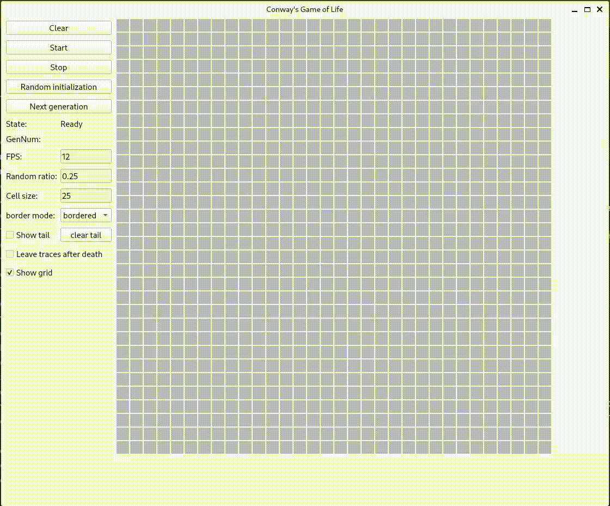
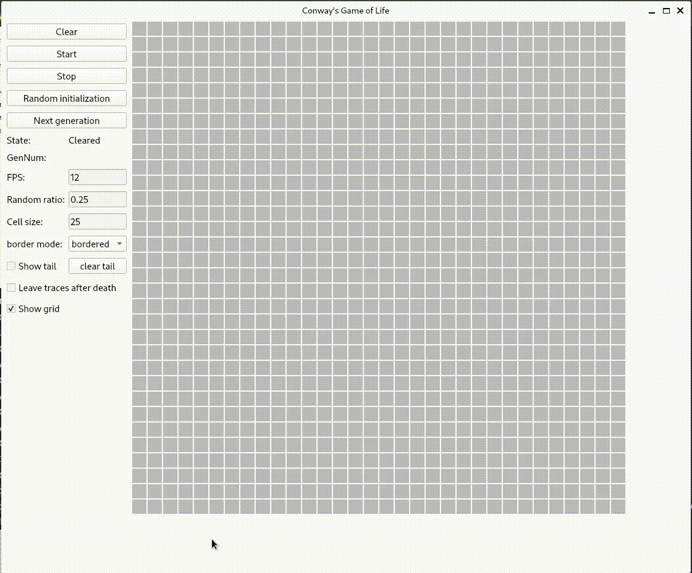
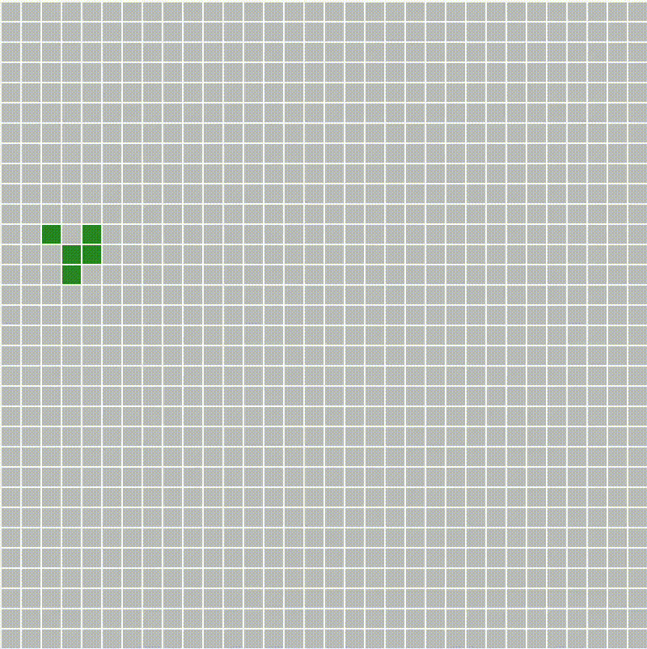
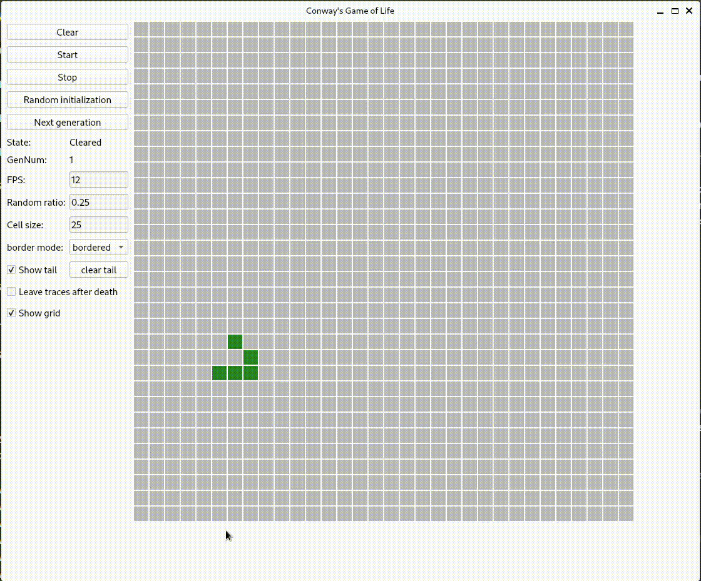

# Implementing Conway's Game of Life using PySide6

## Introduction

This is a simple implementation of Conway's Game of Life using PySide6. The game is a zero-player game, meaning that its evolution is determined by its initial state, requiring no further input. One interacts with the Game of Life by creating an initial configuration and observing how it evolves.

If you want to know more about the game, you can wiki it and see some videos on YouTube.

If you like to use QT, normally you can replace PySide6 with PyQt6

## Implemented functions

- [x] Start / Stop / Clear
- [x] Random initialization
- [x] Custom initialization, you can click on the grid to set the state of the cell when the game is stopped
- [x] Display next generation on button click(`Next generation`)
- [x] Show current state and generation number
- [x] Modify FPS
- [x] Modify random initialization probability
- [x] Modify grid size
- [x] Select border mode
- [x] Show tail / clear tail
- [x] Leave trace of the last generation
- [x] Show grid / hide grid

## How to run

Clone the repository and configure the dependencies. You can install the dependencies using poetry or pip.

I uploaded the poetry.lock file, so you can install the dependencies using poetry.

Or you can install the dependencies using pip.

- dependencies:
    - Python 3.12
    - PySide6 6.7.0
    - NumPy 1.26.4
    - SciPy 1.13.0

Then you can run the program using the following command:

```bash
python3 main.py
```

## How to use

- Start / Stop / Clear
    - You can start, stop, and clear the game using the `Start`, `Stop`, and `Clear` buttons.
      <div>  </div>
- Random initialization <div>  </div>
- Custom initialization
    - You can click on the grid to set the state of the cell when the game is stopped.
      <div>  </div>
- Display next generation
    - You can display the next generation by clicking the `Next generation` button.
- Modify FPS
    - You can modify the FPS, which is in the range of 1 to 60.
- Modify random initialization probability
    - You can modify the random initialization probability, which is in the range of 0.01 to 0.99.
- Modify grid size
    - You can modify the grid size, which is in the range of 5 to 100.
- Select border mode
    - You can select the border mode which is `bordered`, or `donut`.
    - `bordered`: The border is fixed.
    - `donut`: The border is connected. The top and bottom are connected, and the left and right are connected. Under the game rules, you will find one pattern named `Glider`, which will move from one side to the other side.
      like this:
      <div>  </div> You can imagine the glider is an ant, and the surface is a donut surface. The ant moves on the surface.
      <div>  </div>
      
      you can learn more about the _**glider**_ from [here](https://en.wikipedia.org/wiki/Glider_(Conway%27s_Game_of_Life)) and [here](https://en.wikipedia.org/wiki/Gun_(cellular_automaton))
- Show tail / clear tail
    - You can show the tail or clear the tail, which a cell ever lived and now is dead.
- Leave trace of the last generation
    - You can see the trace of the last generation.
- Show grid / hide grid
    - You can show or hide the grid. Default is not showing the grid, because it is more comfortable to see the game without the grid.

## Important change log

- 2024-05-05:</br>
  Changing the core calculation from Python's for loop to NumPy and SciPy's matrix calculation has achieved huge performance improvements. The reason is that NumPy brings the computational power of languages like C and Fortran to Python, and SciPy wraps highly-optimized implementations written in low-level languages like Fortran, C, and C++. In other words, it moves the core calculations from Python implementation to C, c++, fortran implementation. Regarding comparison, it can be found in test_forloop_versus_convolve.py under the test folder. The following results are the results of a certain run on my local machine.</br>
  ```text
  Average time for life_step_for_loop, size 10 x 10: 0.000584 s/step
  Average time for life_step_convolution, size 10 x 10: 0.000034 s/step
  About 17.38x faster
  Average time for life_step_for_loop, size 20 x 20: 0.002209 s/step
  Average time for life_step_convolution, size 20 x 20: 0.000052 s/step
  About 42.78x faster
  Average time for life_step_for_loop, size 50 x 50: 0.013809 s/step
  Average time for life_step_convolution, size 50 x 50: 0.000136 s/step
  About 101.23x faster
  Average time for life_step_for_loop, size 100 x 100: 0.053733 s/step
  Average time for life_step_convolution, size 100 x 100: 0.000452 s/step
  About 118.76x faster
  Average time for life_step_for_loop, size 200 x 200: 0.212505 s/step
  Average time for life_step_convolution, size 200 x 200: 0.001724 s/step
  About 123.27x faster
  ```

## LICENSE

MIT LICENSE
